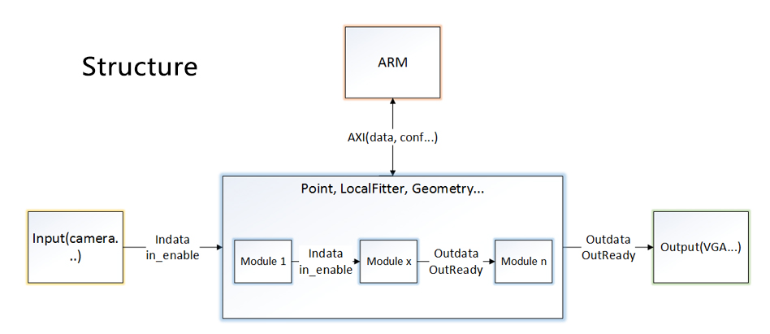
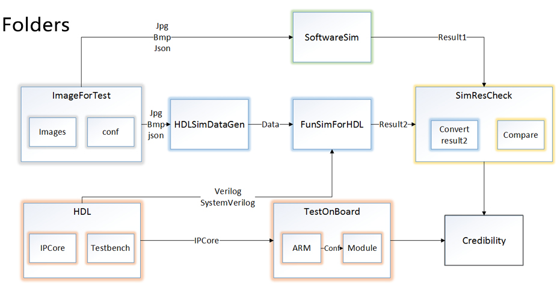

# 一
## 通过一个将RGB图片转化成灰度图的Verilog程序，熟悉了一下verilog图像处理的基本操作语法
- 如何将图片以特定的方式读取进来
- 如何将一个简单算法用verilog实现
- 如何写testbench来验证算法的正确性
- 了解了大致流程
# 二
## 找到一个开源的图像处理的库 [FPGA-Imaging-Library](http://fil.dtysky.moe/index-zh.html#/main-how)
`F-I-L是一个FPGA平台的开源的图像处理库，已经拥有了许多常用操作，并在不断更新中。这些操作被以IP核的形式进行了封装，遵循同一种规范化的接口，同时具有流水线和请求响应两种使用模式。这些IP核最多支持4K分辨率，12bits每通道的色彩以及15x15的窗口。`
### 准备学习一下这个开源项目

